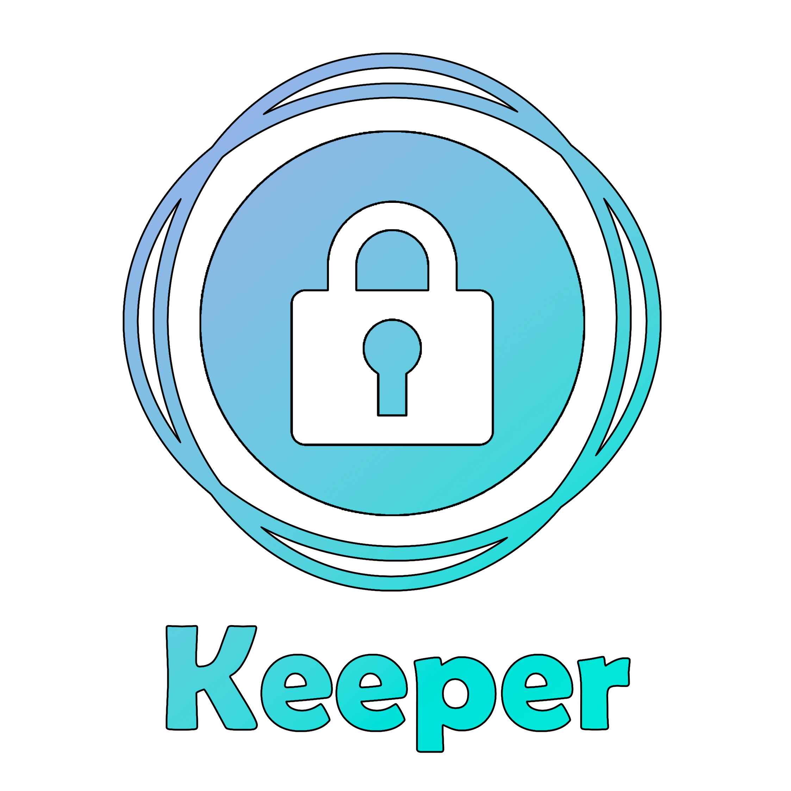

# [Keeper - менеджер паролей](https://t.me/nasavasa_keeper_bot)



### 08.05.2023 - 09.05.2023

### by: [Grachev Vasiliy](http://nasavasa.ru)

#### [Ссылка на бота](https://t.me/nasavasa_keeper_bot)
## Описание

Телеграм-бот позволяет хранить пароли от различных сервисов.
Пароли хранятся в базе данных PostgreSQL, которая находится на локальном сервере.

### Используемые технологии

* Golang 1.20
* PostgreSQL 15
* Docker
* Docker-compose
* Telegram Bot API

### Структура базы данных
* `users` - таблица с пользователями
    + `id` - уникальный идентификатор пользователя
    + `id_tg` - идентификатор пользователя в Telegram
* `services` - таблица с сервисами
    + `id` - уникальный идентификатор сервиса
    + `id_tg` - Telegram-идентификатор владельца сервиса
    + `service_name` - название сервиса
    + `login` - логин от сервиса
    + `password` - пароль от сервиса
    + `created_at` - дата создания записи
### Структура проекта
* `main.go` - файл с точкой входа в программу
* `db` - пакет для работы с базой данных
    + `db.go` - файл с функциями для работы с базой данных
    + `migrations` - папка с миграциями
* `handlers` - пакет с обработчиками запросов
    + `handlers.go` - файл с обработчиком всех запросов к боту
    + `help.go`, `set.go`, `get.go`, `del.go`, `all.go` - файлы с обработчиками запросов для каждой команды бота
* `models` - пакет с моделями
     + `service.go` - файл с моделью сервиса
     + `user.go` - файл с моделью пользователя
* `utils` - пакет с вспомогательными функциями
### Установка и запуск
1. Склонировать репозиторий
```bash
git clone https://github.com/NasaVasa/Keeper.git
```
2. Перейти в папку с проектом
```bash
cd Keeper
```
3. Создать файл `.env` и заполнить его своими переменными, как в файле `.env.example`
4. Запустить docker-compose
```bash
docker-compose up -d
```
5. ***Пригласить создателя на собеседование***
